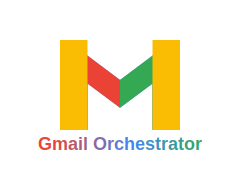

<p align="center">
  
</p>

<h1 align="center">🚀 Gmail Orchestrator Website</h1>

<p align="center">
  <a href="https://github.com/Serverket/gmail-orchestrator/blob/master/LICENSE">
    
  </a>
  <a href="#">
    
  </a>
  <a href="https://reactjs.org/">
    
  </a>
  <a href="https://vitejs.dev/">
    
  </a>
  <a href="https://tailwindcss.com/">
    
  </a>
  <a href="https://bun.sh/">
    
  </a>
  <a href="https://github.com/Serverket/gmail-orchestrator">
    
  </a>
</p>

A modern, responsive website for the Gmail Orchestrator browser extension, providing easy download and installation instructions.

## 🔍 Overview

This website serves as the official landing page for the Gmail Orchestrator Chrome extension, which automates the process of checking external emails in Gmail with a single click instead of waiting hours for Gmail's automatic check.

## ✨ Features

- **📱 Responsive Design:** Fully responsive and works on all devices
- **⚡ Fast Performance:** Built with React and Vite for optimal loading speed
- **🎯 Clear Instructions:** Step-by-step installation guide with visual aids
- **🔄 Direct Download:** Instant access to the extension files
- **📲 Mobile Access:** QR code for easy mobile navigation

## 🛠️ Technologies

- [React](https://reactjs.org/)
- [Vite](https://vitejs.dev/)
- [Tailwind CSS](https://tailwindcss.com/)
- [React Router](https://reactrouter.com/)
- [Bun](https://bun.sh/) for package management and building

## 📦 Installation

1. Clone the repository:
```bash
git clone https://github.com/Serverket/gmail-orchestrator-website.git
cd gmail-orchestrator-website
```

2. Install dependencies:
```bash
bun install
```

3. Run the development server:
```bash
bun run dev
```

4. Build for production:
```bash
bun run build
```

## 🔧 Project Structure

```
gmail-orchestrator-website/
├── public/
│   ├── favicon.svg
│   └── go-qr.png
├── src/
│   ├── assets/
│   ├── components/
│   ├── pages/
│   ├── App.jsx
│   └── main.jsx
├── index.html
├── package.json
└── README.md
```

## 🌐 Deployment

After building the project (`bun run build`), you can deploy the generated `dist` folder to any static hosting service like:

- [GitHub Pages](https://pages.github.com/)
- [Netlify](https://www.netlify.com/)
- [Vercel](https://vercel.com/)

## 🔐 License

This project is licensed under the MIT License - see the [LICENSE](LICENSE) file for details.

## 🤝 Contributing

Contributions are welcome! Please feel free to submit a Pull Request.

1. Fork the project
2. Create your feature branch (`git checkout -b feature/amazing-feature`)
3. Commit your changes (`git commit -m 'Add some amazing feature'`)
4. Push to the branch (`git push origin feature/amazing-feature`)
5. Open a Pull Request

## 🧠 Acknowledgments

_"Whoever loves discipline loves knowledge, but whoever hates correction is stupid."_
